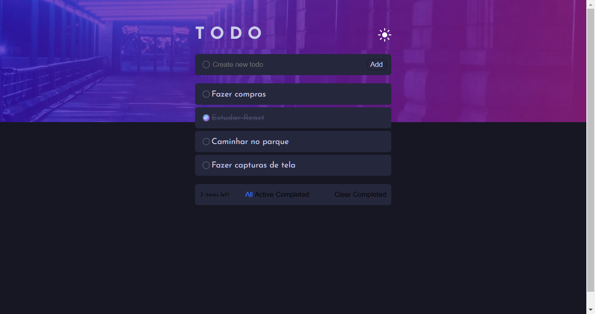

# Todo App

- [Features](#features)
- [Technologies](#technologies)
- [Live Demo](#live-demo)
- [Screenshots](#screenshots)
- [How to Use](#how-to-use)
- [Contributing](#contributing)
- [License](#license)

This is a simple todo app built with React and styled with Sass. The app allows users to create, edit, and delete tasks or to-do items. The user can mark a task as complete or incomplete, and the app also includes a filter function to sort the tasks by status or priority.

This is a multi step form built with React and styled with Sass. The form has 4 steps and a sidebar that indicates the current step.

## <a id="features">Features</a>

## <a id="technologies">Technologies Used</a>
- React
- JavaScript
- SASS

## <a id="live-demo">Live demo</a>

Try the live version of the page [here](https://todo-app-edluel.vercel.app/)

## <a id="screenshots">Sceenshots</a>

Here are some screenshots of the page in action: 

## <a id="how-to-use">How to use it</a>

- Clone the repository
- Open your terminal and navigate to the project directory
- Run npm install to install all the dependencies
- Run npm start to start the development server
- Open http://localhost:3000 to view it in the browser.

## <a id="contributing">Contribute</a>

Feel free to submit pull requests or issues if you have suggestions for improvements. This is a practice project and any feedback is welcome.

## <a id="license">License</a>

This project is lincensed under the MIT license.
